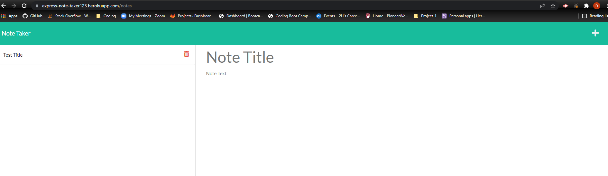

## Title: JS Note Taker
## Description: 
JS Note Taker is an app built to help you save your notes so you don't forget anything important on yopur journey of life.
## Table of Contents: 

- [Installation](#installation)
- [Usage](#usage)
- [License](#license)
- [Contributions](#contributions)
- [Questions](#questions)

## Installation: 

## Usage:
Below you will see a demo of how the JS Note Taker works as well as a screenshot of the notes section.
You can view the app at this deployed location: https://express-note-taker123.herokuapp.com/

## License: 

https://opensource.org/licenses/MIT
## Contributions: 
- DU Staff
- My Tutor
- My classmates

## Questions: 
Contact me at david.faidley23@gmail.com

https://github.com/dfaidley23

JS Note Taker